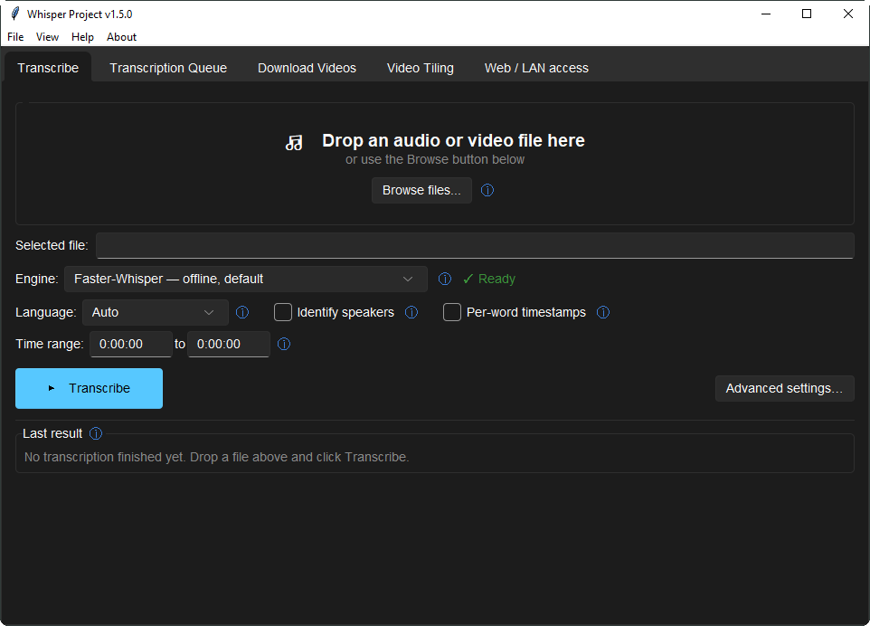
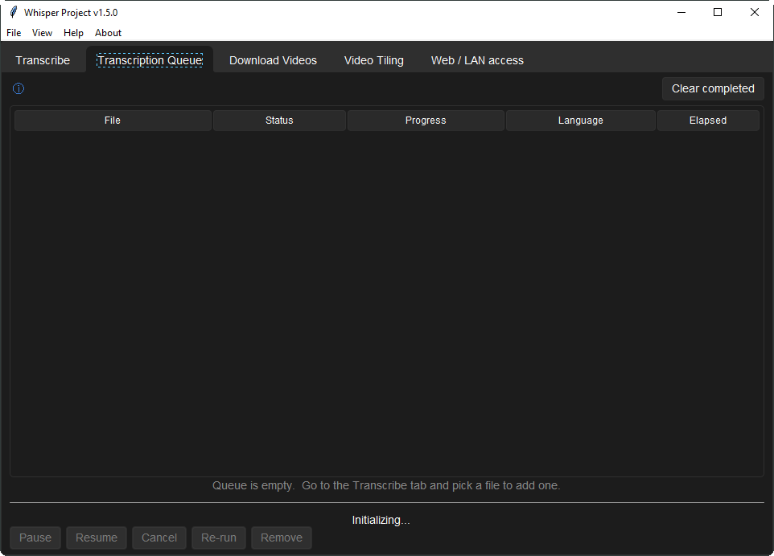
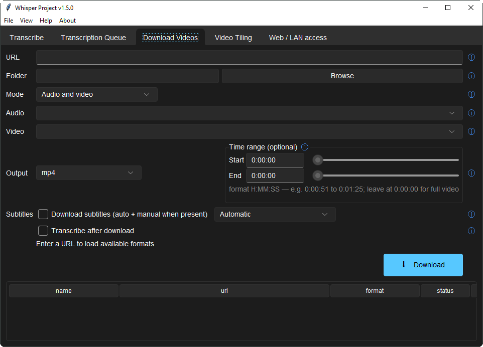
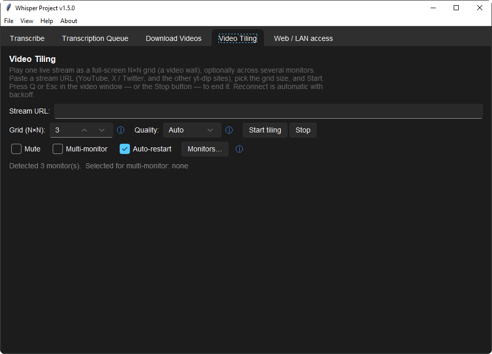
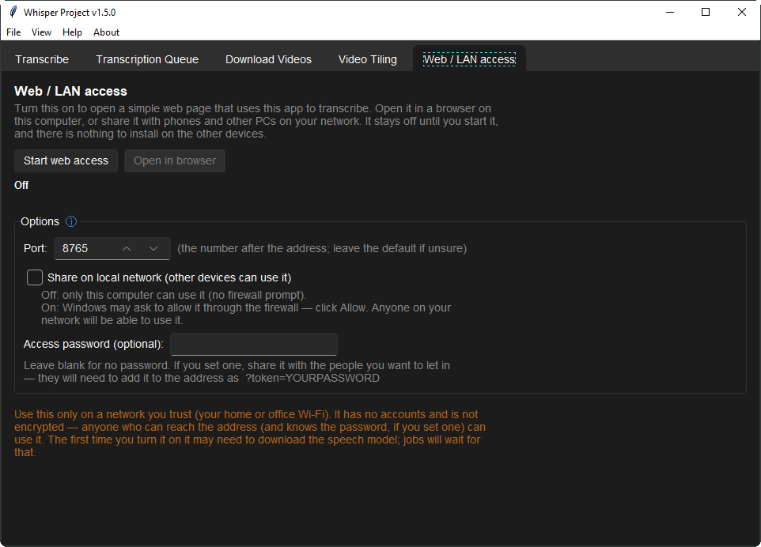

<!--
    title: Whisper Project — offline audio & video transcription for Windows, macOS and Linux
    description: Desktop app that runs OpenAI Whisper locally via faster-whisper. Transcribe audio and video to SRT, VTT, DOCX and PDF with no cloud, no account and no upload. Speaker diarisation, batch queue, yt-dlp downloads, live microphone transcription and a local-network mode.
    keywords: offline speech to text, local whisper GUI, faster-whisper desktop app, audio to text, video to text, subtitle generator, SRT VTT generator, transcription software, speaker diarization, private on-device transcription, yt-dlp downloader, live microphone transcription
    author: translation-robot
    product-type: Desktop transcription software
    platforms: Windows, macOS, Linux
    technology-stack: faster-whisper, CTranslate2, whisper.cpp, NVIDIA Parakeet, Tkinter, yt-dlp, ffmpeg, sherpa-onnx, stable-ts
    license: BSD-3-Clause
-->

<div align="center">


# Whisper Project

### Drag in an audio or video file. Get back a **timed, formatted transcript** — without it ever leaving your computer.

[](https://github.com/Milomilo777/whisper_app/actions/workflows/ci.yml)
[](https://github.com/Milomilo777/whisper_app/releases/latest)
[](https://github.com/Milomilo777/whisper_app/releases)
[](https://codecov.io/gh/Milomilo777/whisper_app)
[](LICENSE)
[](#download)
[](https://github.com/Milomilo777/whisper_app/stargazers)

### [⬇  Download for Windows](https://github.com/Milomilo777/whisper_app/releases/latest)

**[Download](#download)** · **[Screenshots](#what-it-looks-like)** ·
**[Features](#features)** · **[How it works](#how-it-works)** ·
**[Privacy](#offline-by-default)** · **[Docs](#documentation)** ·
**[Build from source](#build-from-source)**

<!-- Language switcher. Flag images rather than flag emoji on purpose:
     Windows does not render regional-indicator emoji as flags, so 🇰🇷
     shows up as the letters "KR" for a large share of readers. -->
<p>
  
  <b>English</b> ∙
  <a href="docs/i18n/README.zh-CN.md"> 简体中文</a> ∙
  <a href="docs/i18n/README.ja.md"> 日本語</a> ∙
  <a href="docs/i18n/README.ko.md"> 한국어</a> ∙
  <a href="docs/i18n/README.de.md"> Deutsch</a> ∙
  <a href="docs/i18n/README.es.md"> Español</a> ∙
  <a href="docs/i18n/README.fr.md"> Français</a> ∙
  <a href="docs/i18n/README.pt.md"> Português</a> ∙
  <a href="docs/i18n/README.fa.md"> فارسی</a>
</p>

</div>

---

A desktop app that runs OpenAI's Whisper model **locally** — via
[faster-whisper](https://github.com/SYSTRAN/faster-whisper) — so transcription
costs nothing per minute, works on a plane, and never uploads your recording to
anyone. Drop a file in and it writes `.srt`, `.vtt`, `.txt`, `.json`, `.docx`,
`.pdf`, `.ass` and more, right next to the original. It also downloads from any site
`yt-dlp` supports, labels speakers, batches a queue of jobs, and can turn itself
into a transcription page for the other devices on your network.

No account. No API key. No subscription. Your files stay on your disk.

- 🔒 **Runs on your machine** — [faster-whisper](https://github.com/SYSTRAN/faster-whisper) (CTranslate2) by default, plus **whisper.cpp** and **NVIDIA Parakeet**
- 📝 **14 output formats** — `srt` `vtt` `ass` `tsv` `txt` `json` `lrc` `md` `docx` `pdf`, plus oTranscribe / ELAN / InqScribe / Express Scribe
- 🎙️ **Live transcription** — a microphone or the system audio, transcribed as it happens → [docs/LIVE.md](docs/LIVE.md)
- 🗣️ **Speaker labels** — offline diarisation, per-word timestamps, time-range clipping
- 🎬 **Downloads** — any `yt-dlp` site, with optional transcribe-on-finish
- 🧹 **Adaptive denoise** — measures the audio and only cleans it when that helps → [docs/DENOISE.md](docs/DENOISE.md)
- 🌐 **Local-network mode** — turn this machine into a transcription page for your other devices
- 💸 **Free and BSD-3 licensed** — no per-minute cost, no subscription, no telemetry by default

## Download

Grab the latest build from the **[releases page](https://github.com/Milomilo777/whisper_app/releases/latest)**:

| Asset | Size | Best for |
|---|---|---|
| **`WhisperProject-…-Setup-Standard.exe`** | ~215 MB | **Most people.** A normal installer: Start-menu shortcut, upgrades in place over an older version, files visible on disk. |
| **`WhisperProject-…-Portable.zip`** | ~330 MB | Unzip and run. No installation, no admin rights, happy on a USB stick. |
| **`WhisperProject-…-macOS-*.dmg`** | ~400 MB | macOS (x64 and arm64 builds are published separately). |

Everything needed is inside — a bundled Python, `ffmpeg`, `ffprobe` and
`yt-dlp`. The only thing fetched later is the speech model itself
(**~1–3 GB, once**, on first launch); after that the app is fully offline.

Step-by-step walkthrough, including what to click past on Windows SmartScreen:
**[docs/INSTALL.md](docs/INSTALL.md)**.

## What it looks like

<div align="center">



<sub>Drop a file, pick your options, press Transcribe. That is the whole workflow.</sub>

</div>

<details>
<summary><b>The other four tabs</b></summary>

<br>

**Transcription Queue** — batch jobs with live progress; pause, resume, cancel,
re-run or remove any row.



**Download Videos** — any `yt-dlp` site: pick a format, clip a time range, pull
subtitles, optionally transcribe as soon as the download finishes.



**Video Tiling** — play one live stream as a full-screen N×N video wall,
optionally across several monitors.



**Web / LAN access** — one button turns this machine into a transcription page
for the phones and PCs on your network.



</details>

## Features

<div align="center">


</div>

| | |
|---|---|
| **Local transcription** | Whisper `large-v3` by default, plus `large-v3-turbo` and `distil-large-v3.5`. Backends: `faster_whisper` (default), `whisper.cpp`, NVIDIA Parakeet. |
| **Many output formats** | `srt` `vtt` `ass` `tsv` `txt` `json` `lrc` `md` `docx` `pdf` — written next to your input file. |
| **Convert transcript** | Re-emit an existing transcript into the formats above, or into oTranscribe / ELAN / InqScribe / Express Scribe. Reads `.ass` / `.ssa` too. |
| **Live transcription** | Transcribe a microphone — or whatever this machine is playing — as it happens. Chunks are cut at natural pauses so words are never split in half. |
| **Speaker diarisation** | Optional "Identify speakers", plus per-word timestamps and time-range clipping. |
| **Adaptive denoise** | Measures each recording first and only cleans it when the measurement says that helps; verifies its own output and reverts if it removed speech. |
| **Last-Result card** | File sizes, one-click **Open file** / **Open folder**, and an in-app viewer with split-pane click-to-seek playback. |
| **Batch queue** | Live status for every pending and running job, with **Pause / Resume / Cancel / Re-run / Remove** always one click away. |
| **Downloads** | Anything `yt-dlp` handles, plus Supreme Master TV episode links. Downloads resume rather than restart. |
| **Video wall** | Tile one live stream as an N×N grid across one or many monitors. |
| **Local network mode** | A stdlib-only web server so other devices can transcribe through this machine — optional password, off until you start it. |
| **Post-processing** | Automatic chapters and hallucination detection, both toggleable. |

Keyboard: `Ctrl+O` browse · `Ctrl+Enter` transcribe · `Esc` cancel ·
`Ctrl+Q` exit.

## How it works

<div align="center">


</div>

The Tk GUI runs in the main process. Each transcription job runs in a
long-lived subprocess worker that keeps the Whisper model in memory and talks
back over newline-delimited JSON on stdin/stdout; `yt-dlp` gets its own
subprocess per download. A per-worker UUID token and a 5-second heartbeat keep
that routing robust against PID recycling and let the GUI detect a wedged
worker instead of hanging with it.

Deeper: [docs/ARCHITECTURE.md](docs/ARCHITECTURE.md) (prose) ·
[docs/architecture.svg](docs/architecture.svg) (full diagram) ·
[docs/DECISIONS.md](docs/DECISIONS.md) (why things are the way they are).

## Offline by default

Every default backend runs on your machine. Nothing is uploaded, no account
exists, and the app works with the network unplugged once the model is
downloaded.

> [!IMPORTANT]
> Two **opt-in** backends break that guarantee, and both are off unless you go
> into **Advanced → Backend** and choose them. Use them only for content you
> are willing to send to a third party.
>
> - **`cloud_stt`** — Google **Gemini API**, authenticated with a free API key
>   you paste. Quickest to set up. → [docs/CLOUD_STT.md](docs/CLOUD_STT.md)
> - **`google_cloud_stt`** — full **Google Cloud Speech-to-Text**, authenticated
>   with a service-account JSON file. 60 free minutes/month, speaker labels, a
>   cheaper batch mode. → [docs/CLOUD_STT_GOOGLE.md](docs/CLOUD_STT_GOOGLE.md)

The optional update check is likewise **notify-only**: it asks GitHub whether a
newer release exists, at most once a day, and never downloads or installs
anything by itself. Turn it off with `update_check_enabled`.

<details>
<summary><b>First run — choosing where the model lives</b></summary>

<br>

On first launch the app asks where to store the Whisper model files. The
default is a private per-user cache that is always writable —
`%LOCALAPPDATA%\WhisperProject\Cache\models` — never the Program Files install
directory. Pick anywhere you like instead: an external drive, a network share.

The choice is saved to `%LOCALAPPDATA%\WhisperProject\config.json` under
`hub_folder`, and the dialog never appears again. To start over:

```cmd
WhisperProject.exe --safe-mode
```

That moves the user config aside and re-fires the first-run dialog with the
defaults.

</details>

<details>
<summary><b>Configuration keys</b></summary>

<br>

User settings live at `%LOCALAPPDATA%\WhisperProject\config.json`.

| Key | What it controls |
|---|---|
| `hub_folder` | Where Whisper model files are stored (set by the first-run dialog) |
| `model_path` | Per-model override; derived from `hub_folder + model.name` when unset |
| `whisper_model` | `large-v3` (default), `large-v3-turbo`, `distil-large-v3.5` |
| `transcribe_backend` | `faster_whisper` (default), `whisper_cpp`, `parakeet`, `cloud_stt`, `google_cloud_stt` |
| `auto_chapters_enabled`, `hallucination_detect_enabled` | Post-process toggles |
| `update_check_enabled` | Opt-in GitHub update check (on by default; notify-only) |
| `last_update_check` | ISO date of the last check (once-per-day throttle) |

Full reference: [docs/CONFIG.md](docs/CONFIG.md).

</details>

<details>
<summary><b>Updating to a newer version</b></summary>

<br>

**No uninstall needed.** The Standard installer uses a stable application ID,
so you just download the newer `…-Setup-Standard.exe` and run it — it upgrades
over the existing install and keeps your shortcut and settings. The Portable
build is self-contained: replace the old folder with the new one.

**Help → Check for updates…** runs the check on demand and also tells you when
you are already current. The quiet daily check stays silent unless something
newer exists, and fails silently when offline.

</details>

<details>
<summary><b>Share it on your local network</b></summary>

<br>

Rather than installing the app on every machine, let people on a trusted
network transcribe through this one. The **Web / LAN access** tab does it with
one button, an optional port, a "Share on local network" checkbox and an
optional access password.

For headless or scripted use there is an equivalent command line (same
stdlib-only HTTP engine):

```cmd
python gui.py serve          REM loopback only (no firewall prompt)
python gui.py serve --lan    REM share on the LAN (allow the firewall prompt)
```

It has no accounts and no encryption — anyone who can reach the address (and
knows the password, if you set one) can use it. Trusted networks only. Routes,
the upload cap and the `--token` option: [docs/SERVER.md](docs/SERVER.md).

</details>

## Build from source

```cmd
git clone https://github.com/Milomilo777/whisper_app.git
cd whisper_app
pip install -r requirements.txt
python gui.py
```

Updating a source checkout later: `platform\windows\update.bat` on Windows,
`platform/linux/update.sh` on Linux — both pull the latest source and
refresh the dependencies ([platform/windows/README.md](platform/windows/README.md)).

[docs/BUILD.md](docs/BUILD.md) covers the build pipelines — which two are
actually shipped and which are kept alive but unpublished —  and
[docs/RELEASE_PROCESS.md](docs/RELEASE_PROCESS.md) has the ship sequence.

Regenerate the images in this README with `python tools/make_graphics.py`
(they are drawn by that script, not pasted in from a design tool).

## Project status

Actively maintained. The quality bar enforced on every commit:

- **pyright** on `app/` and `core/` — 0 errors, 0 warnings, 0 informations.
- The hermetic unit + integration suite (`pytest tests/ --ignore=tests/smoke`)
  runs on **every push, on Windows and Ubuntu** — see
  [docs/TESTING.md](docs/TESTING.md). Coverage is reported by the badge above.

[docs/CHANGELOG.md](docs/CHANGELOG.md) has what shipped recently; superseded
freeze and stability audits are archived under
[docs/history/](docs/history/).

## Documentation

| Doc | Audience |
|---|---|
| [INSTALL.md](docs/INSTALL.md) | End-user install + troubleshooting |
| [SERVER.md](docs/SERVER.md) | Local-network / web server mode (`gui.py serve`) |
| [BUILD.md](docs/BUILD.md) | Build the deliverables yourself |
| [ARCHITECTURE.md](docs/ARCHITECTURE.md) | Process model, threading, protocols |
| [CONFIG.md](docs/CONFIG.md) | Every config key with defaults |
| [CLOUD_STT.md](docs/CLOUD_STT.md) | Optional Gemini-API backend (paste a key) |
| [CLOUD_STT_GOOGLE.md](docs/CLOUD_STT_GOOGLE.md) | Optional Google Cloud STT backend (service account, batch mode) |
| [LIVE.md](docs/LIVE.md) | The Live tab: microphone / system-audio transcription |
| [DENOISE.md](docs/DENOISE.md) | The adaptive denoise pre-process |
| [RELEASE_PROCESS.md](docs/RELEASE_PROCESS.md) | How to ship a new version |
| [CHANGELOG.md](docs/CHANGELOG.md) | Version history |
| [DECISIONS.md](docs/DECISIONS.md) | Non-obvious design choices and why |
| [ROADMAP.md](docs/ROADMAP.md) · [roadmap/](docs/roadmap/) | What is being considered next |

> **Coding agents:** start at [`PROJECT_INDEX.md`](PROJECT_INDEX.md) — a
> generated, tool-neutral repo map built for fast, low-token onboarding.

## Contributing

Issues, pull requests and
[Discussions](https://github.com/Milomilo777/whisper_app/discussions) are all
welcome. [CONTRIBUTING.md](CONTRIBUTING.md) has the dev setup, the quality bar
and the PR conventions; if you are new here, the
[`good first issue`](https://github.com/Milomilo777/whisper_app/labels/good%20first%20issue)
label is the place to start.

This project follows the [Contributor Covenant](.github/CODE_OF_CONDUCT.md).
Security reports go through [SECURITY.md](SECURITY.md).

## Author and license

Written by **translation-robot** — <https://github.com/translation-robot>.

This project's own source is licensed under the **BSD 3-Clause License** — see
[LICENSE](LICENSE). The bundled binaries (`ffmpeg`, `ffprobe`, `yt-dlp`), the
bundled Python runtime and packages, and the Whisper model itself keep their own
upstream licenses; [THIRD_PARTY_NOTICES.md](THIRD_PARTY_NOTICES.md) summarises
them and says what to include when redistributing.

---

<div align="center">
<sub>

**Keywords** — offline speech to text · local Whisper GUI · audio to text ·
video to text · subtitle generator · SRT VTT generator · transcription software ·
speaker diarization · faster-whisper desktop app · yt-dlp downloader ·
private on-device transcription · Windows · macOS · Linux

</sub></div>
