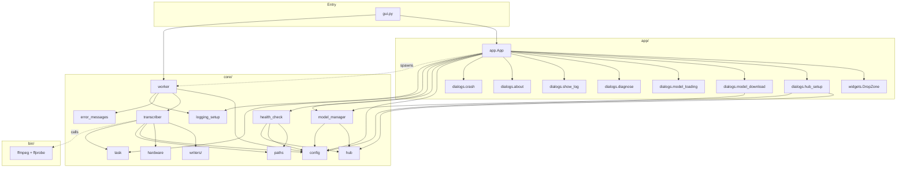
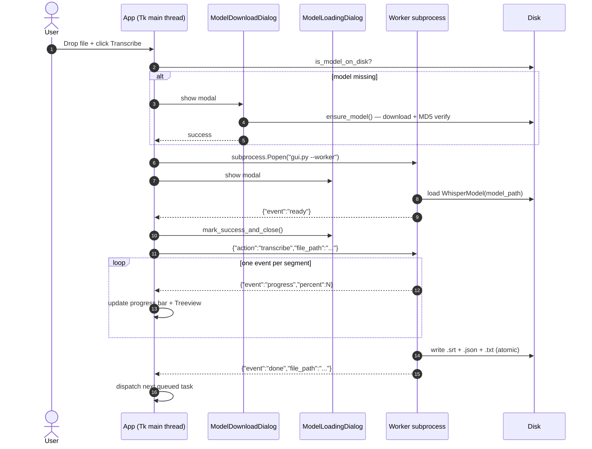

# UML

Two diagrams: a component view of the modules, and a sequence view of one transcribe round-trip.

## Component diagram



## Sequence diagram — first Transcribe click



## Sequence diagram — error path

```mermaid
sequenceDiagram
    autonumber
    participant App
    participant W as Worker
    participant ERR as core.error_messages
    Note over W: transcribe raises (e.g. CUDA OOM)
    W->>ERR: friendly_error(exc)
    ERR-->>W: ("Your GPU ran out of memory.", "Close other GPU-heavy apps…")
    W-->>App: {"event":"error","message":"...","suggestion":"...","file_path":"..."}
    App->>App: show messagebox.showerror with message + suggestion
    App->>App: leave worker alive; dispatch next task
```
