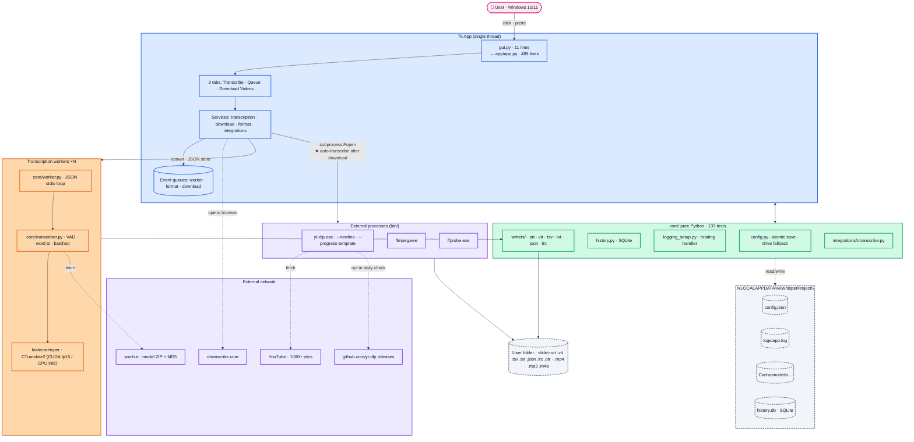
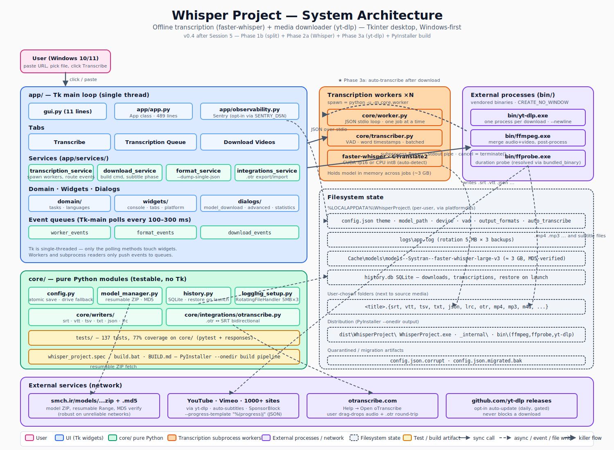

# Architecture diagrams

Two views are provided. Pick the one that fits your need.

- **Simple overview** — a Mermaid flowchart, renders inline on GitHub markdown. Good for "what talks to what" at a glance.
- **Full system diagram** — the colored SVG at [`architecture.svg`](architecture.svg) (1500 × 1100 px, layered, drop shadows, every subsystem labeled). Good for "where exactly does this file live, and what writes to it."

For the long-form prose description (threading rules, cancellation contract, worker stdio protocol, design rationale), see [`ARCHITECTURE.md`](ARCHITECTURE.md).

---

## Simple overview (Mermaid)

Legend: pink = user · blue = UI · green = `core/` · orange = transcription workers · purple = external processes / network · gray dashed = filesystem.

---

## Full system diagram

The colored detailed view, with every subsystem and every file path labeled:

If GitHub doesn't inline the SVG above on your client, open [`architecture.svg`](architecture.svg) directly.

---

## Prose counterpart

See [`ARCHITECTURE.md`](ARCHITECTURE.md) for the long-form description: process model, threading rules, cancellation contract, worker stdio protocol, configuration schema, and the rationale for each choice.

The diagrams answer **what**; `ARCHITECTURE.md` answers **why**.
