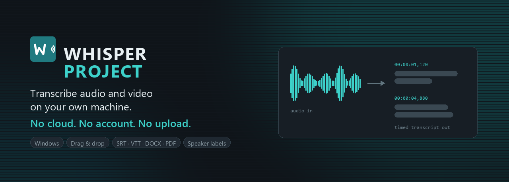
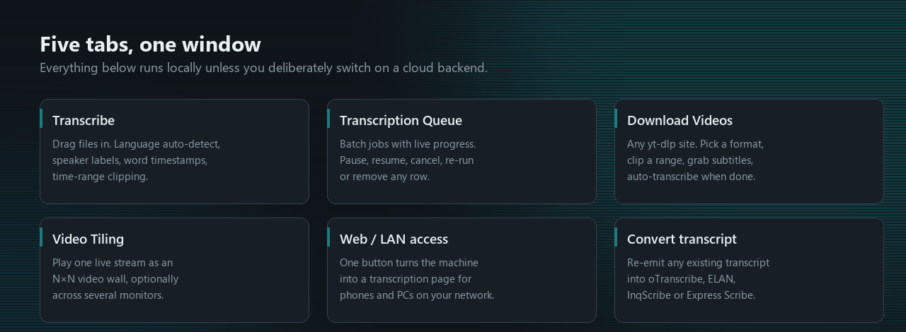
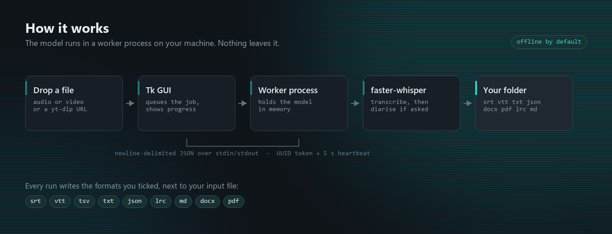

<div align="center">



# Whisper Project

### 拖入音频或视频文件，得到**带时间轴、已排版的文字稿** —— 文件全程不离开你的电脑。

[](https://github.com/Milomilo777/whisper_app/actions/workflows/ci.yml)
[](https://github.com/Milomilo777/whisper_app/releases/latest)
[](https://github.com/Milomilo777/whisper_app/releases)
[](../../LICENSE)
[](https://github.com/Milomilo777/whisper_app/stargazers)

### [⬇  下载 Windows 版](https://github.com/Milomilo777/whisper_app/releases/latest)

<p>
  <a href="../../README.md"> English</a> ∙
  
  <b>简体中文</b> ∙
  <a href="README.ja.md"> 日本語</a> ∙
  <a href="README.ko.md"> 한국어</a> ∙
  <a href="README.de.md"> Deutsch</a> ∙
  <a href="README.es.md"> Español</a> ∙
  <a href="README.fr.md"> Français</a> ∙
  <a href="README.pt.md"> Português</a>
</p>

</div>

---

一款在**本地**运行 OpenAI Whisper 模型的桌面应用（基于 [faster-whisper](https://github.com/SYSTRAN/faster-whisper)）。转写不按分钟计费，断网也能用，录音永远不会被上传给任何人。把文件拖进来，它会在原文件旁边写出 `.srt`、`.vtt`、`.txt`、`.json`、`.docx`、`.pdf` 等格式。它还能从 `yt-dlp` 支持的任意网站下载视频、区分说话人、批量处理队列，并可变成局域网内其他设备的转写页面。

无需账号，无需 API 密钥，无需订阅。文件始终留在你的磁盘上。

- 🔒 **在本机运行** —— 默认 faster-whisper（CTranslate2），另有 whisper.cpp 与 NVIDIA Parakeet
- 📝 **13 种输出格式** —— `srt` `vtt` `tsv` `txt` `json` `lrc` `md` `docx` `pdf`，以及 oTranscribe / ELAN / InqScribe / Express Scribe
- 🎙️ **实时转写** —— 麦克风或系统声音，边说边出字 → [LIVE.md](../LIVE.md)
- 🗣️ **说话人标注** —— 离线声纹分离、逐词时间戳、时间段裁剪
- 🎬 **视频下载** —— 支持 `yt-dlp` 的所有站点，可下载完成后自动转写
- 🧹 **自适应降噪** —— 先测量音频，只在确有帮助时才处理 → [DENOISE.md](../DENOISE.md)
- 🌐 **局域网模式** —— 让这台机器成为其他设备的转写服务页
- 💸 **免费、BSD-3 许可** —— 无按分钟收费、无订阅、默认不发送任何遥测数据

## 下载

从 **[发布页](https://github.com/Milomilo777/whisper_app/releases/latest)** 获取最新版本：

| 文件 | 大小 | 适合 |
|---|---|---|
| **`WhisperProject-…-Setup-Standard.exe`** | ~215 MB | **大多数人。** 常规安装程序：开始菜单快捷方式、可覆盖旧版本升级、文件在磁盘上可见。 |
| **`WhisperProject-…-Portable.zip`** | ~330 MB | 解压即用。无需安装、无需管理员权限，可放在 U 盘里。 |
| **`WhisperProject-…-macOS-*.dmg`** | ~400 MB | macOS（x64 与 arm64 分别发布）。 |

运行所需的一切都已内置 —— 内置 Python、`ffmpeg`、`ffprobe` 和 `yt-dlp`。唯一需要后续下载的是语音模型本身（**约 1–3 GB，仅首次启动时一次**）；此后应用完全离线运行。

## 功能

<div align="center">



</div>

| | |
|---|---|
| **本地转写** | 默认 Whisper `large-v3`，另有 `large-v3-turbo` 与 `distil-large-v3.5`。 |
| **多种输出格式** | `srt` `vtt` `tsv` `txt` `json` `lrc` `md` `docx` `pdf` —— 直接写在源文件旁边。 |
| **实时转写** | 转写麦克风或本机正在播放的声音。切分点落在自然停顿处，不会把词切成两半。 |
| **说话人分离** | 可选的「识别说话人」，另有逐词时间戳与时间段裁剪。 |
| **自适应降噪** | 先测量每段录音，只在测量结果表明有效时才降噪；并会复核自身输出，若削掉了语音则自动还原。 |
| **批量队列** | 每个任务都有实时状态，**暂停 / 继续 / 取消 / 重跑 / 移除** 随时一键可用。 |
| **视频下载** | `yt-dlp` 支持的一切，另加 Supreme Master TV 剧集链接。下载可续传而非重来。 |
| **局域网模式** | 仅用标准库实现的网页服务，让其他设备通过这台机器转写 —— 可设访问密码，未启动前不开放。 |

## 工作原理

<div align="center">



</div>

Tk 图形界面运行在主进程。每个转写任务运行在长期存活的子进程中，该子进程把 Whisper 模型常驻内存，并通过 stdin/stdout 上的换行分隔 JSON 与主进程通信；`yt-dlp` 每次下载各用一个子进程。每个子进程的 UUID 令牌加上 5 秒心跳，使得进程号被系统回收也不会串线，并能让界面发现卡死的子进程而不是跟着一起卡住。

## 默认离线

所有默认后端都在你的机器上运行。没有任何内容被上传，不存在账号；模型下载完成后，拔掉网线也能正常使用。

> [!IMPORTANT]
> 有两个**需要主动选择**的后端会打破这一保证，除非你进入 **Advanced → Backend** 手动选中，否则它们不会启用。只在你愿意把内容发送给第三方时才使用它们。
>
> - **`cloud_stt`** — Google Gemini API → [CLOUD_STT.md](../CLOUD_STT.md)
> - **`google_cloud_stt`** — Google Cloud Speech-to-Text → [CLOUD_STT_GOOGLE.md](../CLOUD_STT_GOOGLE.md)

## 从源码构建

```bash
git clone https://github.com/Milomilo777/whisper_app.git
cd whisper_app
pip install -r requirements.txt
python gui.py
```

## 文档

| 文档 | 内容 |
|---|---|
| [INSTALL.md](../INSTALL.md) | 安装与故障排查 |
| [LIVE.md](../LIVE.md) | 实时转写标签页 |
| [DENOISE.md](../DENOISE.md) | 自适应降噪 |
| [SERVER.md](../SERVER.md) | 局域网 / 网页服务模式 |
| [CONFIG.md](../CONFIG.md) | 全部配置项 |
| [BUILD.md](../BUILD.md) | 自行构建 |
| [CHANGELOG.md](../CHANGELOG.md) | 版本历史 |

> 完整文档为英文。本页面是概览；细节请参阅英文文档。

## 许可证

本项目源码采用 **BSD 3-Clause 许可证** —— 见 [LICENSE](../../LICENSE)。内置的二进制程序（`ffmpeg`、`ffprobe`、`yt-dlp`）、内置的 Python 运行时与依赖包，以及 Whisper 模型本身各自保留其上游许可证；[THIRD_PARTY_NOTICES.md](../../THIRD_PARTY_NOTICES.md) 汇总了这些内容。

---

<div align="center">
<sub>离线语音转文字 · 本地 Whisper 图形界面 · 字幕生成 · 说话人分离 · Windows · macOS</sub>
</div>
